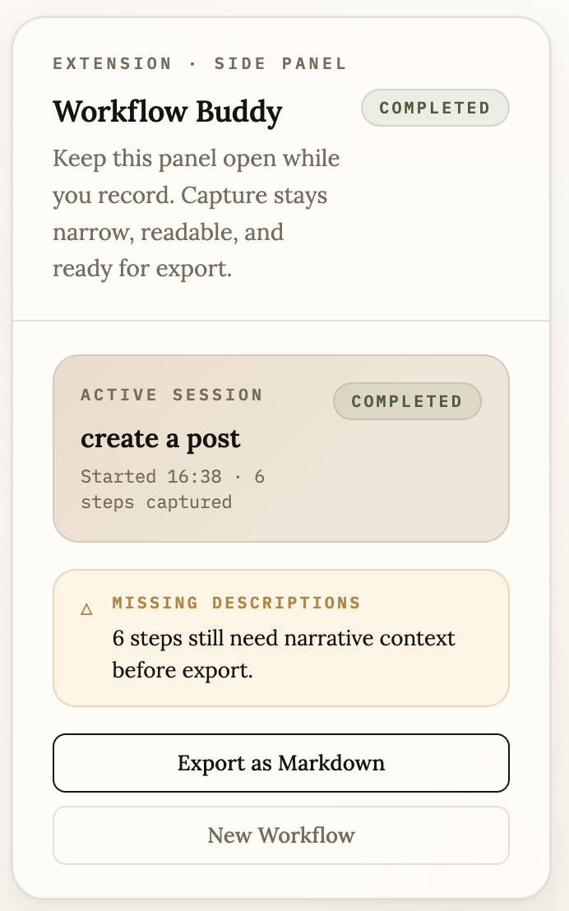
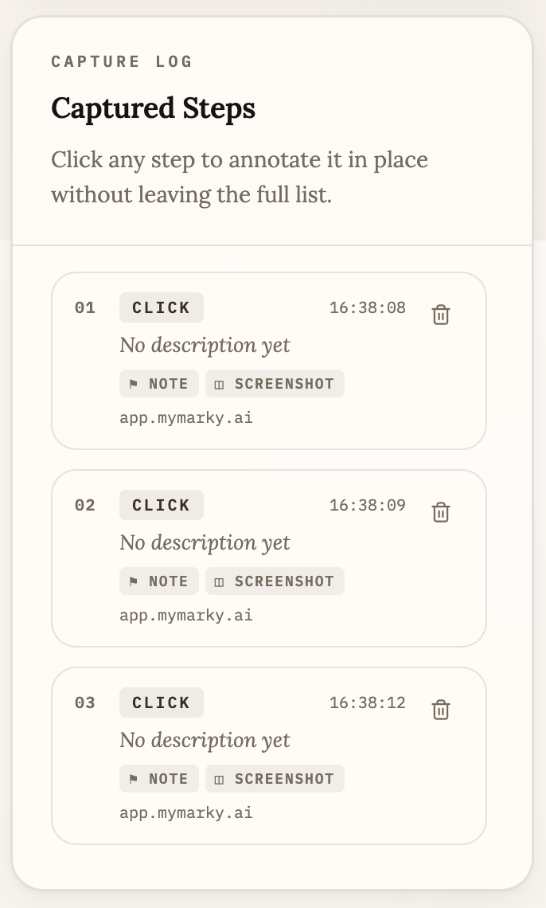
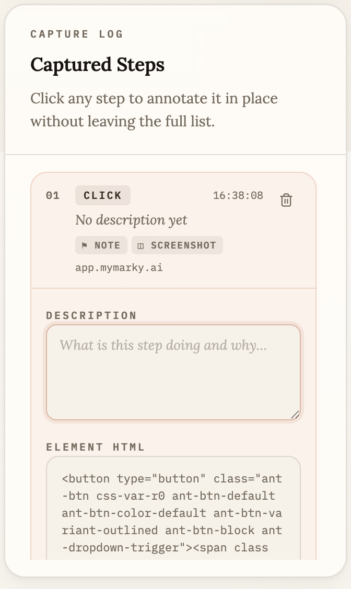

# Workflow Buddy

Workflow Buddy is a Chrome extension for capturing a browser workflow once and exporting it as a structured, LLM-ready document.

It helps a user document a workflow by capturing ordered browser steps, raw target HTML, optional screenshots, and user-written context that another LLM can later turn into automation.

## Screenshots






## Features

- Chrome extension only
- Side-panel-driven recording UI
- One workflow in one tab at a time
- Supported actions: `click` and `type`
- Raw event target HTML captured for each step
- Manual screenshots stored locally in extension storage
- Markdown export for downstream LLM use

## Getting Started

```bash
npm install
npm run build
```

Then load `dist` as an unpacked extension in Chrome.

For local development:

```bash
npm run dev
```

## Tech Stack

- Vite + CRXJS
- XState for recording lifecycle state
- Zod for shared runtime validation
